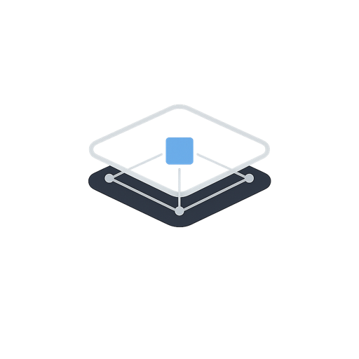

# OpenTask

<p align="center">
  
</p>

<p align="center">OpenClaw 原生工作流 registry、控制面和可视化层。</p>

<p align="center">
  <a href="README.md">English</a> ·
  中文 ·
  <a href="QUICKSTART.ZH.md">快速上手</a> ·
  <a href="docs/registry-spec.ZH.md">Registry 规范</a>
</p>

OpenTask 围绕一个简单分工构建：

- OpenClaw 负责执行。
- OpenTask 负责工作流 registry、运行态投影、审计轨迹和控制 UI。

即使 OpenTask 的后端或前端关闭，工作流也应该继续运行。共享真源是一个 registry 目录，其中包含版本化工作流和 `runs/` 下的运行目录。

## 提供的能力

- 一套 workflow、run、refs、event、control、node output 的 registry 契约
- 一个 Python core library 和 `opentask` CLI，用于确定性的状态变更
- 一个共享 OpenClaw skill：[skills/opentask/SKILL.ZH.md](skills/opentask/SKILL.ZH.md)
- 一个用于索引 registry 和暴露控制 API 的 FastAPI 后端
- 一个用于 DAG 可视化和显式人工控制的 React 控制台

## 架构

### 执行平面

OpenClaw 保持为执行平面。

- 当前 Discord 或频道 session 是 root orchestrator session
- 子任务通过 `sessions_spawn` 派生
- cron 会持续唤醒 root session，直到工作流进入终态
- 内部调度消息不直接投递给用户
- 用户可见更新通过显式 progress message 发送

### 控制平面

OpenTask 退化为 read-mostly control plane。

- 后端索引 registry，并提供 REST 与 WebSocket
- 前端展示 runs、DAG、事件、节点产物和 session 绑定关系
- 操作动作写成显式 control，而不是临时的内存内变更

## Registry 结构

正式规范见 [docs/registry-spec.ZH.md](docs/registry-spec.ZH.md)。

```text
<registry-root>/
  workflows/
    *.task.md
  runs/
    <runId>/
      workflow.lock.md
      state.json
      refs.json
      events.jsonl
      control.jsonl
      nodes/
        <nodeId>/
          report.md
          result.json
```

关键文件：

- `state.json`：给 UI 使用的状态投影
- `refs.json`：OpenClaw 运行时绑定，例如 source session、root session、cron、child sessions
- `events.jsonl`：追加式审计日志
- `control.jsonl`：显式的人工或 UI 控制请求

## 安装

前置条件：

- Python 3.12+
- `uv`
- Node.js 与 `pnpm`
- 一个正在运行的 OpenClaw Gateway
- 一个 workspace 指向当前仓库的 OpenClaw agent

安装依赖：

```bash
uv sync --dev
pnpm --dir web install
```

常用环境变量：

```bash
export OPENTASK_REGISTRY_ROOT=$PWD
export OPENTASK_GATEWAY_URL=ws://127.0.0.1:18789
export OPENTASK_AGENT_ID=opentask
```

OpenTask 会自动复用 `~/.openclaw/identity/` 下的本机 OpenClaw device auth。

### 最快的 OpenClaw 接入方式

最短可用路径是 workspace mode：

1. 克隆这个仓库并安装依赖。
2. 让 OpenClaw agent 的 workspace 指向这个仓库。
3. 把 `OPENTASK_REGISTRY_ROOT` 设为仓库根目录。
4. 在目标 OpenClaw 对话里使用本地 skill `skills/opentask/SKILL.ZH.md`。

这是推荐路径，因为 agent 可以在同一个 workspace 里读取 skill、workflow 和 registry。

### Skill 挂载方式

OpenTask 支持两种让 OpenClaw 看见 skill 的方式：

1. Workspace mode，推荐：
   直接让 agent 在这个仓库 workspace 中运行。
2. Shared-skill mode，可选：
   把 [skills/opentask](skills/opentask) 复制或软链接到你当前 OpenClaw 部署配置的 shared skills 目录。

如果 agent 读不到 [skills/opentask/SKILL.ZH.md](skills/opentask/SKILL.ZH.md)，那就说明它还没有被正确安装到 OpenClaw 里。

## 推荐使用方式

主路径是 OpenClaw 原生工作流：

1. 用户在当前 Discord 或频道对话中提出一个需要长期运行的任务。
2. OpenClaw agent 使用 [skills/opentask/SKILL.ZH.md](skills/opentask/SKILL.ZH.md)。
3. Agent 解析当前 `sessionKey` 和 `deliveryContext`。
4. Agent 在 `workflows/` 下创建或校验工作流文件。
5. Agent 调用 `opentask` CLI，创建并绑定到当前 session 的 run。
6. 后续由 OpenClaw 的 cron 和 subagent 持续推进。

手工等价命令：

```bash
uv run opentask run create \
  --workflow-path workflows/research-demo.task.md \
  --source-session-key 'agent:main:discord:channel:1234567890' \
  --source-agent-id main \
  --delivery-context-json '{"channel":"discord","to":"channel:1234567890"}'
```

## Debug 与运维入口

### CLI

校验工作流：

```bash
uv run opentask workflow validate workflows/research-demo.task.md
```

暂停或恢复：

```bash
uv run opentask control pause <runId>
uv run opentask control resume <runId>
```

发送显式进度消息：

```bash
uv run opentask control send_message <runId> --message "Still running."
```

修改 cron：

```bash
uv run opentask control patch_cron <runId> --patch-json '{"enabled": true}'
```

### 后端

启动后端：

```bash
uv run opentask-api
```

API 默认监听 `http://127.0.0.1:8000`。

### Web UI

启动前端：

```bash
pnpm --dir web dev
```

Vite 应用默认监听 `http://127.0.0.1:5174/`。

UI 是控制面，不是主要起任务入口。它更适合：

- 查看 registry 中的 run 列表
- 检查 DAG 结构和节点产物
- 查看审计事件
- 发起显式动作，例如 `pause`、`resume`、`retry`、`skip`、`approve`、`send_message`、`patch_cron`

## API

公开接口：

- `GET /api/runs`
- `GET /api/runs/{runId}`
- `GET /api/runs/{runId}/events`
- `POST /api/runs/{runId}/actions/{pause|resume|retry|skip|approve|send_message|patch_cron|tick}`
- `WS /api/runs/{runId}/stream`

`POST /api/runs` 仍然保留，但现在只是对同一套 core library 的 debug 和 operator wrapper，不是推荐的生产入口。

## 文档

- [QUICKSTART.ZH.md](QUICKSTART.ZH.md)
- [docs/registry-spec.ZH.md](docs/registry-spec.ZH.md)
- [skills/opentask/SKILL.ZH.md](skills/opentask/SKILL.ZH.md)
- [workflows/research-demo.task.ZH.md](workflows/research-demo.task.ZH.md)
- [web/README.ZH.md](web/README.ZH.md)

## 当前限制

- 推荐启动路径依赖 OpenClaw agent 在调用 CLI 之前先解析当前 session 和 delivery context。
- Registry 锁是本地文件系统锁，不是分布式锁。
- 前端故意保持 read-mostly，不提供自由编辑 DAG。
- 仓库里仍保留 API debug 入口，因为它对运维和测试很有用。
